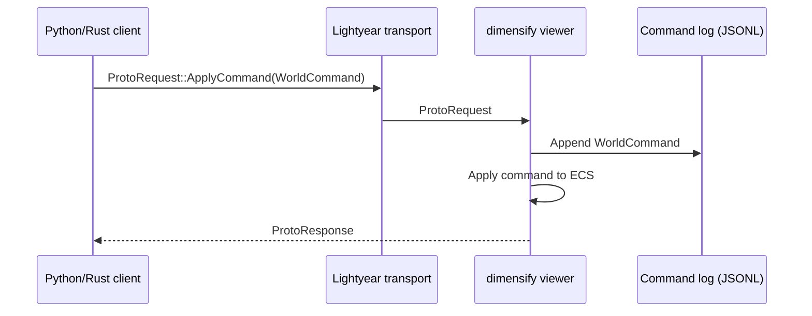

# Current State

!!! note
    This is a snapshot of the repository today. Update this file as behavior changes.

## Crate map

- `crates/dimensify`: viewer, command stream ingestion, telemetry store, transport bridge.
- `crates/protocol`: `WorldCommand`, `ProtoRequest/ProtoResponse`, `ProtoComponent`, telemetry envelope, POD primitives.
- `crates/transport`: Lightyear transport wrapper and env-based config.
- `crates/component_derive`: `#[derive(DimensifyComponent)]` helper for wrapper components.
- `crates/widgets` + `crates/dev_ui`: optional UI command stream and developer widgets.
- `crates/hub`: collaboration hub skeleton (planned).

## What works today

- Scene commands: JSONL replay files (`WorldCommand` per line) and transport ingestion.
- Components: `Name`, `Transform`, `Mesh3d(Shape3d)`, `MeshMaterial3d(Material)`.
- Telemetry: JSONL writer + bounded in-memory store with timeline playback (file replay).
- Telemetry playback supports `latest_at` queries on a selected timeline/time.
- Optional RRD recording when `telemetry_rrd` feature is enabled.
- Telemetry can optionally drive ECS transforms via `DIMENSIFY_TELEMETRY_ECS_SYNC`.
- Python: `World`, `Component`, `Shape3d`, `Vec2/Vec3/Vec4/Quat`, `Dir2/Dir3/Dir4`, `TransportClient`, `TelemetryClient`.
- Widgets: file-based widget command stream for the dev UI.

## Command flow

## Known gaps

- `WorldCommand::Update` and `WorldCommand::Clear` are not implemented yet.
- Telemetry transport + querying is planned (Rerun/Arrow-style); only file replay exists now.
- Python `ViewerClient` is a local JSONL recorder only (no live viewer binding).
