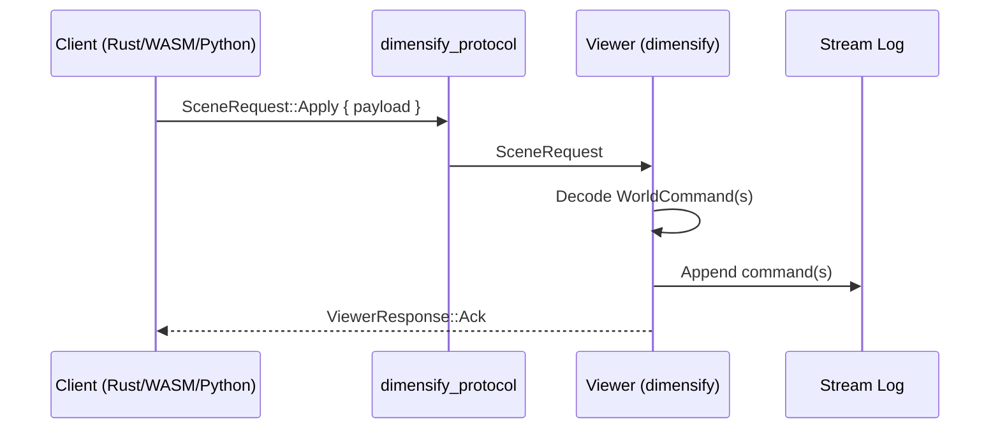

# Overview

!!! note
    Dimensify is **viewer-first**. Simulation is optional and feature-gated.

Dimensify consumes a replayable **stream** of scene commands (and optional telemetry). By default it runs as a pure visualizer. A simulation backend can be enabled via plugins.

## Collaboration (planned)

- **Stream is canonical**: all authoritative changes are emitted as stream events.
- **Replication is live**: optional real-time transport for collaborative inputs/state.
- **Viewer default**: tail the stream; replication is only a producer of stream events.

## Modes

- **Viewer-only**: render from local/file/DB streams.
- **Sim mode**: backend publishes telemetry + scene commands into the same stream.
- **Hub mode (planned)**: multi-user collaboration via `dimensify_hub` (feature-gated).

## Data source configuration (native)

- `DIMENSIFY_DATA_SOURCE`: `local` | `file` | `db`
- `DIMENSIFY_FILE`: JSONL replay file (for `file` source)
- `DIMENSIFY_DB_ADDR`: `IP:PORT` (for `db` source)
- `DIMENSIFY_VIEWER_MODE`: `2d` | `3d`

## Telemetry configuration (native)

- `DIMENSIFY_TELEMETRY_SOURCE`: `local` | `file`
- `DIMENSIFY_TELEMETRY_FILE`: JSONL telemetry file (for `file` source)

## Transport configuration (native)

- `DIMENSIFY_TRANSPORT_MODE`: `webtransport` | `websocket` | `udp`
- `DIMENSIFY_TRANSPORT_CONNECTION`: `server` | `client`
- `DIMENSIFY_TRANSPORT_ENDPOINT`: `viewer` | `controller`
- `DIMENSIFY_TRANSPORT_SERVER_ADDR`: `host:port`

!!! note
    WASM builds default to `connection=client` and must connect to a native transport server.

## Philosophy

- Viewer-first: keep visualization stable and backend-agnostic.
- Feature-gated compute: opt into Nox/XLA when needed.
- Schema stability: standardize stream/telemetry types early.
- Multi-target: support native + WASM with consistent APIs.

## Protocol philosophy

Dimensify treats the protocol as a thin, portable contract that favors easy integration over engine-specific types.
The viewer is the authoritative interpreter; transports only deliver `SceneRequest` messages.

