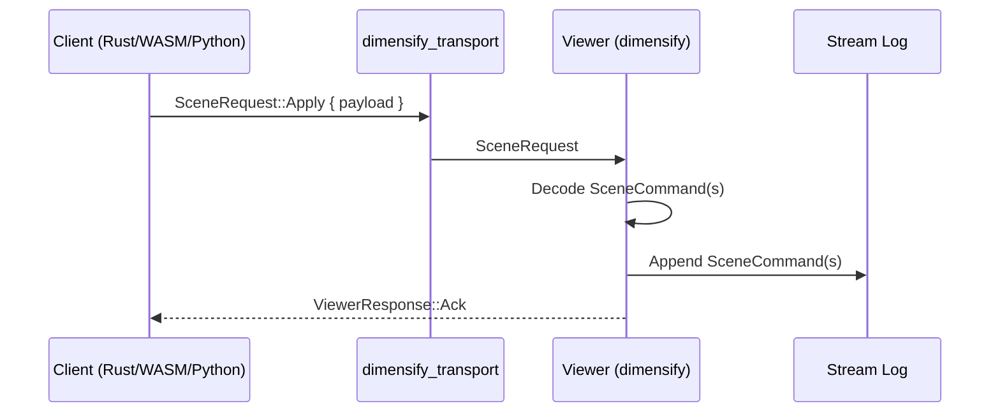

# Protocol Design

!!! note
    Dimensify is viewer-first. The protocol is action-based and backend-agnostic.

## Principles

- Protocol types are portable and Bevy-free.
- Actions describe intent; components carry data.
- Transport payload format is an implementation detail.
- Stream is canonical; transport is optional.

## Core types

`SceneCommand` expresses actions:

- `Spawn { components }`
- `Insert { entity, components }`
- `Update { entity, component }`
- `Remove { entity, component }`
- `Despawn { entity }`
- `Clear`

`Component` carries data (examples):

- `Name { value }`
- `Mesh3d { name, position, scale }`
- `Line3d { name, points, color, width }`
- `Transform3d { position, rotation, scale }`
- `Rect2d { name, position, size, rotation, color }`

`ComponentKind` is used by `Remove` to target a component type.

## Transport requests

Transport uses `SceneRequest::Apply { payload }` with JSON payloads (single `SceneCommand` or an array).
`SceneRequest` also supports `List` and `Clear` control requests.



## Example payloads

Spawn a cube and a line in a single command:

```json
{
  "Spawn": {
    "components": [
      { "type": "Name", "value": "demo_cube" },
      {
        "type": "Mesh3d",
        "name": "demo_cube",
        "position": [0.0, 0.0, 0.0],
        "scale": [1.0, 1.0, 1.0]
      },
      {
        "type": "Line3d",
        "points": [[0.0, 0.0, 0.0], [1.0, 1.0, 1.0]],
        "color": [1.0, 1.0, 1.0, 1.0],
        "width": 1.0
      }
    ]
  }
}
```

Update a transform:

```json
{
  "Update": {
    "entity": "demo_cube",
    "component": {
      "type": "Transform3d",
      "position": [0.2, 0.4, 0.1],
      "rotation": [0.0, 0.0, 0.0, 1.0],
      "scale": [1.0, 1.0, 1.0]
    }
  }
}
```

## Bevy wrapper pattern

Use `DimensifyComponent` to map wrapper components to protocol `Component` variants.

```rust
use bevy::prelude::*;
use dimensify_component_derive::DimensifyComponent;

#[derive(Component, Clone)]
pub struct Line3dComponent {
    pub name: Option<String>,
    pub points: Vec<[f32; 3]>,
    pub color: [f32; 4],
    pub width: f32,
}

#[derive(DimensifyComponent, Clone)]
#[dimensify(command = "Line3d")]
pub struct Line3dWrapper {
    pub name: Option<String>,
    pub points: Vec<[f32; 3]>,
    pub color: [f32; 4],
    pub width: f32,
}
```

Use `#[dimensify(into)]` on fields that should call `.into()` during conversion.
