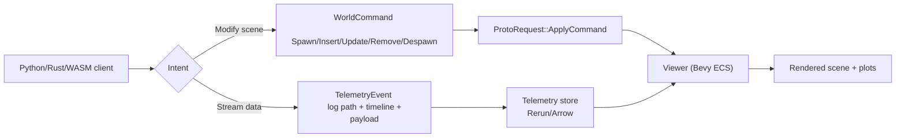
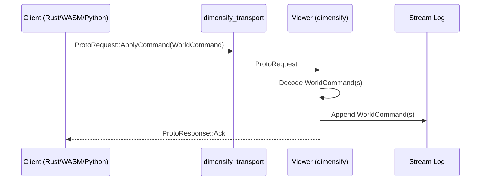

# Protocol Design

!!! note
    Dimensify is viewer-first. The protocol is action-based and backend-agnostic.

## Principles

- Protocol types are portable and rendering-agnostic.
- Actions describe intent; components carry data.
- Transport payload format is an implementation detail.
- Stream is canonical; transport is optional.

## Mental model

Dimensify keeps two independent logs:

- **Command log**: authoritative actions (`WorldCommand`) for replay and collaboration.
- **Telemetry/state log**: high-rate state events (Rerun-like) for inspection and plotting.

Replication is an optional live transport that emits new command entries; it does not replace the
command log or telemetry log.

## Telemetry (planned)

Telemetry types exist today, but ingestion is file-based.
We plan a Rerun-like telemetry stream for high-rate state events.

- **Viewer ECS** stays as the current state used for rendering.
- **Telemetry store** lives outside ECS (Arrow/Parquet or similar) for replay and queries.
- **TODO**: define timeline semantics (`sim_time`, `frame`, and custom log paths).
- **Playback**: viewer can select a timeline + time and query latest values per path.
- **Viewer state**: `TelemetryState` maintains latest values for the active timeline.
- **ECS sync (optional)**: telemetry can be mapped to ECS transforms by path convention.

### Proposed telemetry envelope

We follow Rerun-style log paths and timelines.

```text
TelemetryEvent { path, time, payload, metadata }
TelemetryTime { timeline, value }
TelemetryPayload { Scalar | Vec2 | Vec3 | Vec4 | Text | Blob }
```

This keeps telemetry POD-friendly and decoupled from Bevy types.

## User flow



## Core types

`WorldCommand` expresses actions:

- `Spawn { components }`
- `Insert { entity, components }`
- `Update { entity, component }`
- `Remove { entity, component }`
- `Despawn { entity }`
- `Clear`

`Component` carries data (current variants):

- `Name(String)`
- `Transform { translation, rotation, scale }`
- `Mesh3d(Shape3d)`
- `MeshMaterial3d(Material)`

`Remove` targets a component id returned by `ProtoRequest::List`.

`Shape3d` includes Bevy math primitives such as `Sphere`, `Cuboid`, `Capsule3d`, and `Plane3d`.

!!! warning
    `WorldCommand::Update` and `WorldCommand::Clear` are not implemented in the viewer yet.

## POD guidance

Protocol payloads should remain POD-like and stable:

- Use `[f32; N]` for vectors/quaternions.
- Use `String`/`Vec<u8>` for identifiers and blobs.
- Avoid Bevy render types (e.g., `Mesh`) in the protocol.
- Prefer references (`MeshRef`/URI) or `Blob` payloads for heavy assets.
- POD vector types (`Vec2`/`Vec3`/`Vec4`/`Quat`) serialize as JSON arrays for easy interop.

## Bevy adapters (recommended)

Define protocol types as POD and add feature-gated adapters for Bevy types in a Bevy-only crate
or module. This avoids leaking Bevy render types to Python while keeping native ergonomics.

```rust
#[cfg(feature = "bevy")]
impl From<bevy::prelude::Transform> for Transform {
    fn from(t: bevy::prelude::Transform) -> Self {
        Self {
            position: Vec3([t.translation.x, t.translation.y, t.translation.z]),
            rotation: Quat([t.rotation.x, t.rotation.y, t.rotation.z, t.rotation.w]),
            scale: Vec3([t.scale.x, t.scale.y, t.scale.z]),
        }
    }
}
```

## Transport requests

Transport uses `ProtoRequest::ApplyCommand(WorldCommand)` messages. `ProtoRequest`
also supports `List` for entity inspection.



## Example payloads

Spawn a cube with material and transform:

```json
{
  "Spawn": {
    "components": [
      { "Name": "demo_cube" },
      { "Mesh3d": { "Sphere": { "radius": 0.5 } } },
      { "MeshMaterial3d": { "Color": { "r": 0.2, "g": 0.6, "b": 1.0, "a": 1.0 } } },
      {
        "Transform": {
          "translation": [0.0, 0.0, 0.0],
          "rotation": [0.0, 0.0, 0.0, 1.0],
          "scale": [1.0, 1.0, 1.0]
        }
      }
    ]
  }
}
```

Update a transform (entity ids come from `Entity::to_bits()` or `List`):

```json
{
  "Update": {
    "entity": 123456789,
    "component": {
      "Transform": {
        "translation": [0.2, 0.4, 0.1],
        "rotation": [0.0, 0.0, 0.0, 1.0],
        "scale": [1.0, 1.0, 1.0]
      }
    }
  }
}
```

## Bevy wrapper pattern

Use `DimensifyComponent` to map wrapper components to protocol `Component` variants.

```rust
use bevy::prelude::*;
use dimensify_component_derive::DimensifyComponent;

#[derive(DimensifyComponent, Clone)]
#[dimensify(command = "Transform")]
pub struct TransformWrapper {
    #[dimensify(into)]
    pub translation: Vec3,
    #[dimensify(into)]
    pub rotation: Quat,
    #[dimensify(into)]
    pub scale: Vec3,
}
```

Use `#[dimensify(into)]` on fields that should call `.into()` during conversion.

## Telemetry-driven ECS (optional)

Dimensify can map telemetry back into ECS for playback. The default path convention is:

```text
entity/<name>/transform/translation  (Vec3)
entity/<name>/transform/rotation     (Vec4, xyzw)
entity/<name>/transform/scale        (Vec3)
```

Enable with `DIMENSIFY_TELEMETRY_ECS_SYNC=on` or via the timeline UI toggle.
